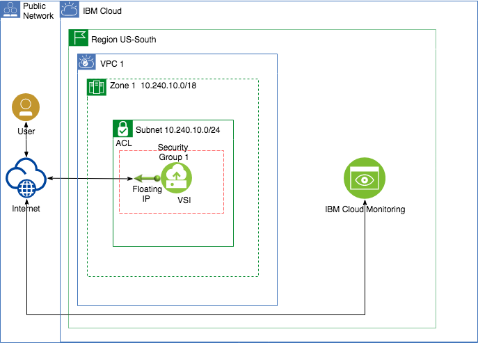

# Use GUI, CLI or API to deploy a VPC and connect a VPC Application to a Monitoring service.

### Purpose
This scenario illustrates how to integrate IBM Cloud Monitoring with an application installed in a VPC. This scenario uses the [IBM Cloud Console](https://cloud.ibm.com) for interacting with the IBM Cloud.

The example shown in this scenario includes a Node.js application (*AppMonitor*) which pushes a custom metric to the IBM Cloud Monitoring service.

After completing the scenario you will be able to:
- Create Virtual Private Clouds using the IBM Cloud console
- Create linux Virtual Servers in a Virtual Private Cloud
- Connect to and execute commands in a linux Virtual Server
- Provision an IBM Cloud Monitoring service using the IBM Cloud console
- Push a custom monitoring Metric to IBM Cloud Monitoring from a Virtual Server
 

#### The AppMonitor sample application
This scenario includes a small Node.js application called `AppMonitor`. This Node.js application provides a simple REST API to issue a custom metric to the IBM Cloud Monitoring service.

`AppMonitor` uses the [Express.js Framework](https://expressjs.com/) to serve the 'sendMetric' REST API.

`AppMonitor` uses the [IBM Cloud Monitoring Node Library](https://www.npmjs.com/package/ibm-cloud-monitoring) to send metrics to IBM Cloud Monitoring.

### Architecture


### Prerequisites
1. An IBM Cloud Account
2. Authority to create Organizations, Spaces, VPC resources and IBM Monitoring service in the IBM Cloud Account
3. A provisioned instance of the [IBM Monitoring service](https://cloud.ibm.com/catalog/services/monitoring)
4. IBM Cloud API Key for Monitoring service. [Generating an API Key](https://cloud.ibm.com/docs/services/cloud-monitoring/security?topic=cloud-monitoring-auth_api_key#auth_api_key)
7. ssh-keygen installed locally.

### Assumptions
1. You have basic knowledge of the linux VI editor

## Creating a Virtual Private Cloud.
First we must create a Virtual Private Cloud (VPC) and a Virtual Server in the VPC that the `AppMonitor` sample application will execute in. The instructions to deploy the VPC infrastructure for this scenario are available in these flavors:
1. [Using the IBM Cloud CLI](README-cli.md)
2. [Using the IBM Console UI](README-console.md)
3. [Using the IBM Cloud API](README-api.md)

## Install the AppMonitor sample application
Now that we have a VPC and a Virtual Server Instance, it is time to install the AppMonitor application.

1. Issue the following command to access the Virtual Server from your workstation: 
   
    - `ssh root@*floating ip*`  
       The *floating ip* is the IP address assigned to the VPC's VSI in the previous section.

   If you need to specify the SSH Key file, use the following command:

    - `ssh -i *ssh key file* root@*floating ip*`
       The *ssh key file* is the full path and filename of the SSH Key file created with your VPC.

2. Update the local package repository. Issue the command 

    - `sudo apt-get update`
3. Install the LTS version of [Node.js](https://nodejs.org/en/) (which includes NPM) by issuing the following commands:
    - `curl -sL https://deb.nodesource.com/setup_10.x | sudo -E bash -`
    - `sudo apt-get install -y nodejs`

**Note**: If receiving a `groot` error, follow the instructions in the error message and update `/boot/grub/menu.lst`.

4. Verify the Node.js and NPM installation is complete by issuing the commands:
    - `node -v`
    - `npm -v` 

5. Create a new directory called 'appMonitor' and change to that directory by issuing these commands:
    - `mkdir appMonitor`
    - `cd appMonitor`

6. Create the *package.json* file by issuing the command `vi package.json`
7. Copy the following code to your clipboard and add it to the file. 
```
{
    "name": "AppMonitorDemo",
    "version": "0.0.1",
    "private": true,
    "scripts": {
        "start": "node main.js"
    },
    "dependencies": {
        "express": "4.15.x",
        "ibm-cloud-monitoring": "^0.1.0"
    },
    "repository": {},
    "engines": {
        "node": "6.x"
    }
}
```   
8. Save and exit the file
9. Create the *main.js* file by issuing the command `vi main.js`
10. Copy and paste the entire *main.js* source file into the vi editor. [Open the main.js file](appMonitor/appMonitor.js)
11. Update the following constants in `main.js` file with your values. See [Sending data by using the Metrics API](https://cloud.ibm.com/docs/services/cloud-monitoring/security?topic=cloud-monitoring-send_data_api) documentation:
    - `cloudAPIKey` - Your IBM Cloud API Key (see Prerequisites section).
    - `spaceGUID` - IBM Cloud Space GUID where the Monitor service resides.
    - `monitorEndPoint` - Metrics Monitor endpoint.
11. Save and exit the file
12. Issue the command `npm update`
13. Start the application by issuing the command `npm start`

## Sending a custom monitor metric to IBM Cloud Monitoring
Now that we have the `AppMonitor` installed and running on the Virtual Server lets send a metric.

**Do not** close the SSH session that AppMonitor is executing in.

1. Open a new Terminal/Command Prompt on your workstation.
   
2. Issue the following command:

   `ssh root@*floating ip*`  
    - The *floating ip* is the IP address assigned to the VPC's VSI in the previous section.

   If you need to specify the SSH Key file, use the following command:

   `ssh -i *ssh key file* root@*floating ip*`
    - The *ssh key file* is the full path and filename of the SSH Key file created with your VPC.

3. Issue the following command to send a custom metric: 

     `curl http://localhost:6001/sendMetric`

5. You should see the IBM Cloud Monitor response
*Hint: If there was an error of any kind while sending the custom metric, you will see that error displayed in the SSH session which is running AppMonitor*


## Links
- [IBM Cloud VPC](https://cloud.ibm.com/docs/vpc-on-classic?topic=vpc-on-classic-getting-started)
- [IBM Cloud Monitoring - Getting Started](https://cloud.ibm.com/docs/services/cloud-monitoring?topic=cloud-monitoring-getting-started)
- [IBM Cloud Monitoring Node Library](https://www.npmjs.com/package/ibm-cloud-monitoring)
- [IBM Catalog Monitoring service](https://cloud.ibm.com/catalog/services/monitoring)
- [Metric Rest API](https://cloud.ibm.com/apidocs/monitoring-metrics-api#send-metrics-to-a-space)


